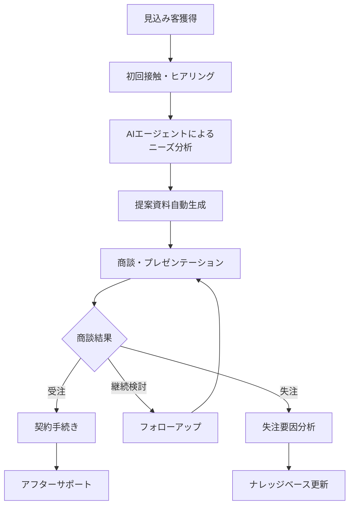
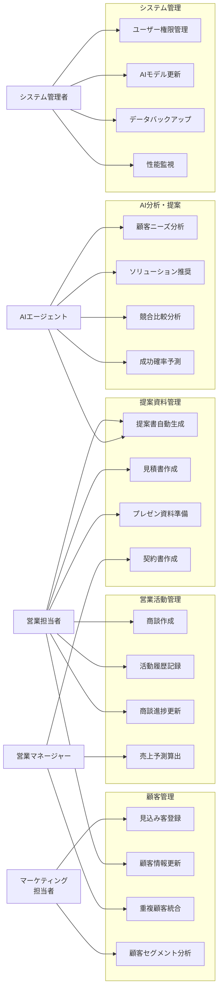
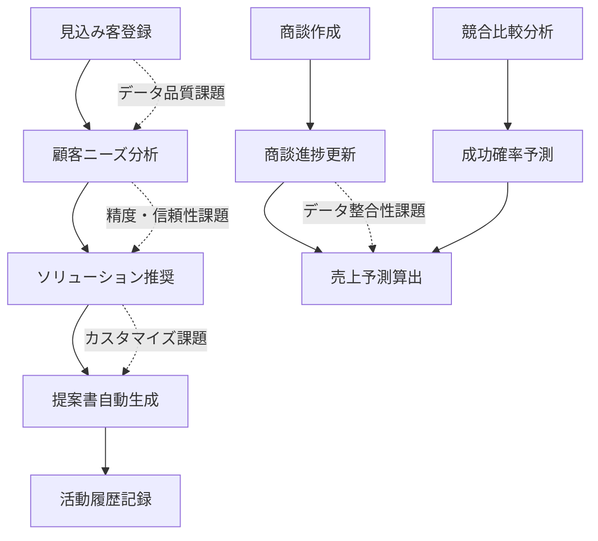
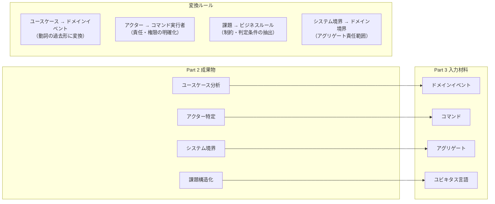

# DDDワークショップ & 既存システム整理 ～Azure移行を見据えて～

## Part 2: 既存業務・システム整理 & 現状課題の棚卸し

**🎯 このフェーズの目的**
- 営業支援AIエージェントアプリの現状を構造化して把握する
- 業務フロー・システム構成・課題を可視化し、全参加者で共通認識を形成する
- Part 3のドメインモデリングの土台となる素材を整理する
- Azure移行の必要性・効果を判断するための基礎データを収集する

**📊 想定成果物**
1. **業務フロー図**: 営業プロセス全体の可視化（AS-IS）
2. **ユースケース図・分析**: アクター・機能要件の構造化
3. **システム構成図**: 現在の技術アーキテクチャの整理
4. **優先度付き課題リスト**: 影響度・緊急度での分類済み課題一覧
5. **ドメイン候補領域**: Part 3で重点分析すべきドメイン境界の特定

**🔄 Part 1からの引き継ぎ事項**
- DDDの基本概念理解（特にドメイン・境界づけられたコンテキスト）
- 営業支援AIアプリでの具体例イメージ
- ユビキタス言語の重要性認識

**➡️ Part 3への受け渡し事項**
- **アクター・ユースケース一覧**: ドメインイベント・コマンド抽出の素材
- **業務課題構造**: 解決すべきビジネスルール・制約の明確化
- **システム境界認識**: ドメイン境界・アグリゲート設計の参考
- **データ品質課題**: ユビキタス言語・整合性ルールの検討材料

---

## 📋 目次

1. [既存業務・システム整理](#1-既存業務システム整理-40分)
2. [現状課題の棚卸し](#2-現状課題の棚卸し-50分)
3. [成果物テンプレート](#成果物テンプレート)

---

## 1. 既存業務・システム整理 (40分)

### 1.1 営業支援AIエージェントアプリの業務フロー整理 (20分)

#### 🎯 ワークの目的
1. **現状業務の可視化**: 営業プロセス全体を俯瞰し、AI活用ポイントを明確化
2. **システム連携の把握**: 各業務ステップで使用するシステム・ツールの整理
3. **課題発見の準備**: 業務フローの中でボトルネック・非効率ポイントを特定

#### 📋 ワーク手順・期待成果

**Step 1: 標準業務フローの確認・カスタマイズ (10分)**
- **期待成果**: 自社に特化した営業プロセスフロー図
- **確認ポイント**: 各ステップの所要時間、担当者、成功率

営業支援AIエージェントアプリの標準的な業務フローを参考に、自社の実際の業務フローを整理：



**各ステップで確認すべきポイント:**

| ステップ | 確認項目 | 具体例 |
|---------|---------|-------|
| 見込み客獲得 | どこから、どのような方法で？ | ・Web問い合わせ<br/>・展示会<br/>・紹介<br/>・テレアポ |
| 初回接触・ヒアリング | 誰が、どのようなツールで？ | ・営業担当者<br/>・Web会議システム<br/>・ヒアリングシート |
| AIニーズ分析 | AIはどのような分析を行う？ | ・業界分析<br/>・課題抽出<br/>・ソリューション候補提示 |
| 提案資料生成 | どのような資料が自動生成される？ | ・提案書<br/>・見積書<br/>・デモ資料 |
| 商談・プレゼン | どのような形式で実施？ | ・対面商談<br/>・オンライン商談<br/>・デモンストレーション |

**Step 2: システム・ツール・担当者マッピング (10分)**
- **期待成果**: 業務ステップ別のシステム利用状況一覧
- **重要ポイント**: AI活用ポイント、手動作業箇所、システム間連携の識別

営業支援AIエージェントアプリに関わる関係者と役割を整理：

| 業務ステップ | 担当者 | 主要システム・ツール | AI活用度 | 所要時間 | 課題・改善点 |
|-------------|--------|-------------------|---------|---------|-------------|
| 見込み客獲得 | マーケティング担当 | ・Webサイト<br/>・MA（Marketing Automation）<br/>・展示会管理システム | 低（20%） | 1-2日 | ・重複リード管理<br/>・質の低いリード混在 |
| 初回接触・ヒアリング | 営業担当者 | ・CRM<br/>・Web会議システム<br/>・ヒアリングシート | 中（50%） | 2-3時間 | ・ヒアリング項目標準化不足<br/>・情報記録の属人化 |
| AIニーズ分析 | AIエージェント + 営業担当 | ・AI分析エンジン<br/>・ナレッジベース<br/>・業界データベース | 高（80%） | 30分-1時間 | ・分析精度のばらつき<br/>・結果の解釈困難 |
| 提案資料生成 | 営業担当 + AIシステム | ・提案書テンプレート<br/>・AI文書生成<br/>・見積システム | 高（70%） | 1-2時間 | ・カスタマイズ作業残存<br/>・承認フロー長期化 |
| 商談・プレゼン | 営業担当者 | ・プレゼンツール<br/>・デモ環境<br/>・商談記録システム | 低（30%） | 1-3時間 | ・商談記録の標準化不足<br/>・次回アクション管理 |
| 受注・契約手続き | 営業マネージャー + 事務 | ・契約管理システム<br/>・電子署名<br/>・売上管理 | 中（40%） | 2-5日 | ・承認フロー複雑<br/>・書類作成の手間 |

### 1.2 システム構成図・データフロー図の作成 (20分)

#### 🏗️ 現在のシステム構成例

営業支援AIエージェントアプリの典型的なシステム構成：

```
┌─────────────────────────────────────────────────────────────┐
│                    フロントエンド層                          │
├─────────────────────────────────────────────────────────────┤
│ Web アプリ │ モバイルアプリ │ 営業ダッシュボード │ 管理画面    │
└─────────────────────────────────────────────────────────────┘
                                ↓
┌─────────────────────────────────────────────────────────────┐
│                     API ゲートウェイ                        │
└─────────────────────────────────────────────────────────────┘
                                ↓
┌─────────────────────────────────────────────────────────────┐
│                   アプリケーション層                         │
├─────────────────────────────────────────────────────────────┤
│ 顧客管理     │ 商談管理     │ AIエージェント │ 提案資料生成   │
│ サービス     │ サービス     │ サービス       │ サービス       │
└─────────────────────────────────────────────────────────────┘
                                ↓
┌─────────────────────────────────────────────────────────────┐
│                     データ層                               │
├─────────────────────────────────────────────────────────────┤
│ 顧客DB │ 商談DB │ 文書DB │ ナレッジDB │ ログDB │ AI学習データ │
└─────────────────────────────────────────────────────────────┘
                                ↓
┌─────────────────────────────────────────────────────────────┐
│                   外部連携                                 │
├─────────────────────────────────────────────────────────────┤
│ CRM連携 │ MA連携 │ 会計システム │ メール配信 │ AI/MLサービス │
└─────────────────────────────────────────────────────────────┘
```

#### 📊 データフローの例

**顧客情報から提案書生成までのデータフロー:**

```
1. 顧客情報入力 → 顧客DB保存
2. ヒアリング情報 → 商談DB保存
3. AIエージェント → 顧客DB + 商談DB + ナレッジDB参照
4. ニーズ分析結果 → AI分析結果DB保存
5. 提案資料生成 → 文書DB保存
6. 営業活動履歴 → 活動ログDB保存
```

#### 🛠️ ワーク: 自社システム構成図作成

**作成手順:**
1. 現在使用しているシステム・ツールを列挙
2. それぞれの責任範囲を明確化
3. システム間のデータ連携を図示
4. データの流れを矢印で表現

**テンプレート使用項目:**
- [ ] Webアプリケーション
- [ ] モバイルアプリ
- [ ] 管理画面
- [ ] API層
- [ ] データベース
- [ ] AIエンジン
- [ ] 外部システム連携
- [ ] バックアップ・DR環境

---

## 2. 現状課題の棚卸し (50分)

### 2.1 ユースケース図による現状分析 (25分)

#### 🎯 ユースケース分析の目的
1. **アクター（利用者）の特定**: システムを利用する人・システムの明確化
2. **機能要件の整理**: 各アクターが実行する具体的な操作・業務の体系化
3. **課題の構造化**: ユースケース毎の問題点・改善ポイントの発見
4. **ドメイン境界の発見**: Part 3のドメインモデリングにつながる機能グループの識別

#### 📊 営業支援AIエージェントアプリのユースケース図



#### � ユースケース詳細分析・課題抽出ワーク (15分)

**Step 1: 重要ユースケースの詳細化 (8分)**

各ユースケースについて現状の課題を詳細分析：

| ユースケースID | ユースケース名 | 主アクター | 現状の課題・問題点 | 影響度 | 頻度 | Azure解決見込み |
|---------------|--------------|-----------|------------------|--------|------|----------------|
| UC01 | 見込み客登録 | マーケティング担当者 | ・重複チェック機能不足<br/>・データ入力項目の標準化なし<br/>・外部システムとの連携遅延 | 高 | 日次 | 95% |
| UC05 | 商談作成 | 営業担当者 | ・テンプレート不統一<br/>・必須項目チェック甘い<br/>・過去案件との関連付け困難 | 高 | 日次 | 90% |
| UC09 | 顧客ニーズ分析 | AIエージェント | ・分析精度のばらつき<br/>・結果の説明可能性不足<br/>・リアルタイム分析不可 | 高 | 日次 | 98% |
| UC13 | 提案書自動生成 | 営業担当者 + AI | ・生成品質の不安定さ<br/>・カスタマイズ作業残存<br/>・承認ワークフロー複雑 | 中 | 週次 | 85% |
| UC08 | 売上予測算出 | 営業マネージャー | ・予測モデルの陳腐化<br/>・外部要因考慮不足<br/>・予測根拠の不透明さ | 高 | 月次 | 90% |

**Step 2: ユースケース間の依存関係・連携課題分析 (7分)**



**依存関係における主要課題:**

1. **データ品質の連鎖影響**: 
   - 見込み客登録の品質問題がAI分析精度に直結
   - 不正確な顧客データが全後続プロセスに悪影響

2. **リアルタイム性の欠如**:
   - 商談進捗更新が売上予測に即座に反映されない
   - AI分析結果と提案書生成のタイムラグ

3. **システム間データ連携**:
   - CRM ↔ AI分析エンジン ↔ 文書生成システムの非同期処理課題
   - データ形式・スキーマの不整合

### 2.2 課題の構造化・優先度分析 (25分)

#### � 課題カテゴリー別分析 (15分)

**データ品質・整合性課題**
```
顧客データ品質
├── 重複・不整合データ（影響度: 高）
├── 入力項目標準化不足（影響度: 中）
├── 外部システム連携遅延（影響度: 高）
└── データ検証ルール不備（影響度: 中）

商談データ品質  
├── 進捗ステータス曖昧性（影響度: 高）
├── 活動履歴記録漏れ（影響度: 中）
├── 成功確率算出根拠不明（影響度: 高）
└── 失注要因分析不足（影響度: 中）
```

**AI・機械学習課題**
```
AI分析精度
├── 学習データ品質問題（影響度: 高）
├── モデル更新頻度不足（影響度: 中）
├── 結果説明可能性不足（影響度: 高）
└── バイアス・公平性考慮不足（影響度: 中）

AI活用効率
├── 推論処理速度遅延（影響度: 中）
├── カスタマイズ柔軟性不足（影響度: 高）
├── 人間との協調作業困難（影響度: 高）
└── 継続学習機能不備（影響度: 中）
```

**システム統合・連携課題**
```
アーキテクチャ課題
├── モノリシック構成の限界（影響度: 高）
├── スケーラビリティ不足（影響度: 中）
├── 可用性・耐障害性不備（影響度: 高）
└── セキュリティ設計古さ（影響度: 高）

運用・保守課題
├── デプロイ・更新複雑さ（影響度: 中）
├── 監視・アラート体制不備（影響度: 高）
├── ログ分析・トラブルシュート困難（影響度: 中）
└── 災害対策・事業継続性不足（影響度: 高）
```

#### 📊 課題影響度マトリックス・Azure解決可能性評価 (10分)

#### 📊 課題影響度マトリックス・Azure解決可能性評価 (10分)

**高影響度 × 高緊急度（最優先課題）**

| 課題ID | 課題内容 | 現状影響 | Azure解決手段 | 解決見込み | 対策コスト |
|--------|---------|---------|--------------|-----------|-----------|
| C001 | 顧客データ重複・不整合 | 営業効率30%低下 | Cosmos DB + AI統合 | 95% | 中 |
| C002 | AI分析精度の不安定性 | 提案品質のばらつき | Azure OpenAI + MLOps | 90% | 高 |
| C003 | システム可用性不足 | 月2-3回の業務停止 | Container Apps + 冗長化 | 98% | 中 |
| C004 | リアルタイム分析不可 | 機会損失20%増 | Event Hubs + Stream Analytics | 95% | 中 |

**中影響度課題（計画的対応）**

| 課題ID | 課題内容 | 現状影響 | Azure解決手段 | 解決見込み | 対策コスト |
|--------|---------|---------|--------------|-----------|-----------|
| C005 | 提案書カスタマイズ工数 | 1件あたり2時間超過 | AI Builder + Power Automate | 85% | 低 |
| C006 | セキュリティ設計の古さ | コンプライアンス懸念 | Azure AD + Key Vault | 99% | 中 |
| C007 | 運用監視体制不備 | 障害対応遅延 | Azure Monitor + Log Analytics | 95% | 低 |
| C008 | スケーラビリティ限界 | ピーク時性能低下 | Auto Scaling + Load Balancer | 90% | 中 |

#### 🎯 ドメインモデリングへの課題インプット整理

**Part 3で重点的に扱うべき課題領域:**

1. **顧客ドメインの課題**
   - 顧客情報の一意性・整合性保証
   - 顧客ライフサイクル管理の複雑さ
   - マルチチャネル顧客接点の統合

2. **商談ドメインの課題**  
   - 商談ステータス管理の曖昧性
   - 売上予測精度の向上必要性
   - 営業活動と成果の因果関係不明

3. **AI分析ドメインの課題**
   - 分析結果の信頼性・説明可能性
   - 学習データ品質管理
   - 人間の判断との協調メカニズム

4. **提案ドメインの課題**
   - 自動生成と手動カスタマイズの境界
   - 提案品質の標準化・評価
   - 承認ワークフローの効率化

**ユースケース→ドメインモデル変換の指針:**



**Part 3での具体的活用方法:**

| Part 2 成果物 | Part 3 での変換・活用 | 具体例 |
|--------------|---------------------|-------|
| UC01: 見込み客登録 | ドメインイベント: `見込み客が登録された` | 顧客アグリゲート設計の起点 |
| アクター: 営業担当者 | コマンド実行者: `商談を作成する` | 責任・権限のビジネスルール |
| 課題: データ重複 | ビジネスルール: `同一企業は1つのエンティティ` | 顧客一意性制約 |
| システム: CRM↔AI | ドメイン境界: 顧客↔AI分析 | アグリゲート間連携設計 |

---

## 成果物テンプレート・チェックリスト

### 📋 ユースケース分析成果物テンプレート

#### ユースケース詳細分析シート

| 項目 | 内容 | 記入例 |
|------|------|--------|
| **ユースケースID** | UC001-020の連番 | UC009 |
| **ユースケース名** | 具体的な機能・操作名 | 顧客ニーズ分析 |
| **主アクター** | 主たる実行者 | AIエージェント |
| **サブアクター** | 関連する実行者 | 営業担当者（結果確認） |
| **事前条件** | 実行前に満たすべき条件 | 顧客基本情報が登録済み |
| **成功シナリオ** | 正常な実行フロー | 1.顧客データ読込<br/>2.AI分析実行<br/>3.結果出力 |
| **代替シナリオ** | 例外・エラー処理 | データ不足時は警告表示 |
| **事後条件** | 実行後の状態 | 分析結果がDBに保存 |
| **現状の課題** | 問題点・改善点 | ・精度のばらつき<br/>・処理時間長期化 |
| **Azure解決案** | クラウド移行での改善策 | Azure OpenAI活用 |

#### ✅ ユースケース分析完了チェックリスト

**基本要素**
- [ ] 全アクター（人・システム）の特定完了（5-8アクター）
- [ ] 主要ユースケースの洗い出し完了（15-25ケース）
- [ ] ユースケース間の関係性整理完了
- [ ] 各ユースケースの現状課題特定完了

**詳細分析**
- [ ] 重要ユースケース（5-8件）の詳細化完了
- [ ] 事前条件・事後条件の明確化
- [ ] 正常・異常シナリオの整理
- [ ] システム境界・責任範囲の明確化

**Part 3への引き継ぎ準備**
- [ ] ユースケース→ドメインイベント変換表作成
- [ ] アクター→コマンド実行責任表作成
- [ ] 課題→ビジネスルール候補リスト作成
- [ ] システム境界→ドメイン境界対応表作成
- [ ] ユビキタス言語候補（20-30語）抽出完了

### � 課題影響度分析テンプレート

#### 課題詳細分析シート

| 課題ID | カテゴリ | 課題名 | 詳細説明 | 定量的影響 | 定性的影響 | 根本原因 | 影響度 | 緊急度 | Azure解決可能性 | 推定解決コスト |
|--------|---------|--------|---------|-----------|-----------|---------|--------|--------|-----------------|---------------|
| C001 | データ品質 | 顧客情報重複 | 同一顧客の複数エントリ | 重複率15%<br/>工数月40h | 営業効率低下<br/>顧客満足度悪化 | 入力検証不足<br/>統合ルール未整備 | 高 | 中 | 95% | 中（3-6ヶ月） |
| C002 | AI精度 | ニーズ分析精度 | AI推奨の的中率低い | 的中率65%<br/>（目標85%） | 提案品質ばらつき<br/>営業信頼性低下 | 学習データ不足<br/>特徴量設計不備 | 高 | 高 | 90% | 高（6-12ヶ月） |

### 🎯 Part 2完了基準・Part 3引き継ぎ要件

**📊 成果物完成度目標**
- ユースケース図・分析: 90%完成（主要ケース + 詳細分析）
- 課題リスト・優先度評価: 95%完成（定量評価 + Azure解決可能性）
- システム構成理解: 85%完成（現状把握 + 課題マッピング）
- ドメイン境界認識: 80%完成（機能グループ + 責任範囲）

**🤝 参加者理解度目標**
- 現状システムの課題構造化: 全員90%以上
- ユースケース・アクター関係: 技術者95%・業務担当85%以上
- Azure移行効果の見積もり: プロジェクトマネージャー90%以上
- ドメインモデリング準備: 全員85%以上

**➡️ Part 3への具体的引き継ぎ事項**
- [ ] **ユースケース→ドメインイベント変換表**: UC001-020から25-30個のイベント抽出準備
- [ ] **アクター→コマンド実行責任表**: 各アクターの実行権限・責任範囲の整理
- [ ] **課題→ビジネスルール変換表**: データ品質・AI精度課題から制約条件抽出
- [ ] **システム境界→ドメイン境界マップ**: 現状システム分割からアグリゲート設計指針
- [ ] **ユビキタス言語候補リスト**: ユースケース・課題分析から抽出した業務用語（20-30語）

---

**Previous:** [Part 1: オープニング・DDD基礎講座](workshop-part1-opening-and-ddd-basics.md)  
**Next:** [Part 3: ドメインモデリング体験](workshop-part3-domain-modeling.md)
