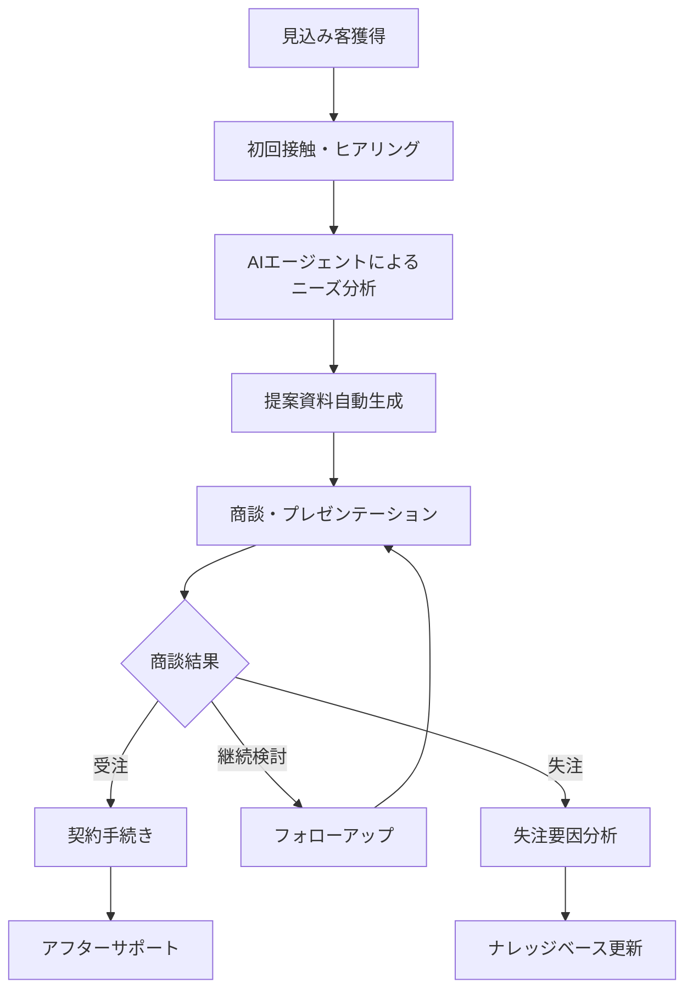

# DDDワークショップ & 既存システム整理 ～Azure移行を見据えて～

## Part 2: 既存業務・システム整理 & 現状課題の棚卸し

**🎯 このフェーズの目的**
- 営業支援AIエージェントアプリの現状を構造化して把握する
- 業務フロー・システム構成・課題を可視化し、全参加者で共通認識を形成する
- Part 3のドメインモデリングの土台となる素材を整理する
- Azure移行の必要性・効果を判断するための基礎データを収集する

**📊 想定成果物**
1. **業務フロー図**: 営業プロセス全体の可視化（AS-IS）
2. **システム構成図**: 現在の技術アーキテクチャの整理
3. **データフロー図**: システム間・データ間の関係性明確化
4. **優先度付き課題リスト**: 影響度・緊急度での分類済み課題一覧
5. **課題影響度マトリックス**: 解決難易度vs影響度での課題分析

**🔄 Part 1からの引き継ぎ事項**
- DDDの基本概念理解（特にドメイン・境界づけられたコンテキスト）
- 営業支援AIアプリでの具体例イメージ
- ユビキタス言語の重要性認識

**➡️ Part 3への受け渡し事項**
- 現状システムの構造理解
- 主要な業務課題の共通認識
- ドメインモデリング対象範囲の特定

---

## 📋 目次

1. [既存業務・システム整理](#1-既存業務システム整理-40分)
2. [現状課題の棚卸し](#2-現状課題の棚卸し-20分)
3. [成果物テンプレート](#成果物テンプレート)

---

## 1. 既存業務・システム整理 (40分)

### 1.1 営業支援AIエージェントアプリの業務フロー整理 (20分)

#### 🎯 ワークの目的
1. **現状業務の可視化**: 営業プロセス全体を俯瞰し、AI活用ポイントを明確化
2. **システム連携の把握**: 各業務ステップで使用するシステム・ツールの整理
3. **課題発見の準備**: 業務フローの中でボトルネック・非効率ポイントを特定

#### 📋 ワーク手順・期待成果

**Step 1: 標準業務フローの確認・カスタマイズ (10分)**
- **期待成果**: 自社に特化した営業プロセスフロー図
- **確認ポイント**: 各ステップの所要時間、担当者、成功率

営業支援AIエージェントアプリの標準的な業務フローを参考に、自社の実際の業務フローを整理：



**各ステップで確認すべきポイント:**

| ステップ | 確認項目 | 具体例 |
|---------|---------|-------|
| 見込み客獲得 | どこから、どのような方法で？ | ・Web問い合わせ<br/>・展示会<br/>・紹介<br/>・テレアポ |
| 初回接触・ヒアリング | 誰が、どのようなツールで？ | ・営業担当者<br/>・Web会議システム<br/>・ヒアリングシート |
| AIニーズ分析 | AIはどのような分析を行う？ | ・業界分析<br/>・課題抽出<br/>・ソリューション候補提示 |
| 提案資料生成 | どのような資料が自動生成される？ | ・提案書<br/>・見積書<br/>・デモ資料 |
| 商談・プレゼン | どのような形式で実施？ | ・対面商談<br/>・オンライン商談<br/>・デモンストレーション |

**Step 2: システム・ツール・担当者マッピング (10分)**
- **期待成果**: 業務ステップ別のシステム利用状況一覧
- **重要ポイント**: AI活用ポイント、手動作業箇所、システム間連携の識別

営業支援AIエージェントアプリに関わる関係者と役割を整理：

| 業務ステップ | 担当者 | 主要システム・ツール | AI活用度 | 所要時間 | 課題・改善点 |
|-------------|--------|-------------------|---------|---------|-------------|
| 見込み客獲得 | マーケティング担当 | ・Webサイト<br/>・MA（Marketing Automation）<br/>・展示会管理システム | 低（20%） | 1-2日 | ・重複リード管理<br/>・質の低いリード混在 |
| 初回接触・ヒアリング | 営業担当者 | ・CRM<br/>・Web会議システム<br/>・ヒアリングシート | 中（50%） | 2-3時間 | ・ヒアリング項目標準化不足<br/>・情報記録の属人化 |
| AIニーズ分析 | AIエージェント + 営業担当 | ・AI分析エンジン<br/>・ナレッジベース<br/>・業界データベース | 高（80%） | 30分-1時間 | ・分析精度のばらつき<br/>・結果の解釈困難 |
| 提案資料生成 | 営業担当 + AIシステム | ・提案書テンプレート<br/>・AI文書生成<br/>・見積システム | 高（70%） | 1-2時間 | ・カスタマイズ作業残存<br/>・承認フロー長期化 |
| 商談・プレゼン | 営業担当者 | ・プレゼンツール<br/>・デモ環境<br/>・商談記録システム | 低（30%） | 1-3時間 | ・商談記録の標準化不足<br/>・次回アクション管理 |
| 受注・契約手続き | 営業マネージャー + 事務 | ・契約管理システム<br/>・電子署名<br/>・売上管理 | 中（40%） | 2-5日 | ・承認フロー複雑<br/>・書類作成の手間 |

### 1.2 システム構成図・データフロー図の作成 (20分)

#### 🏗️ 現在のシステム構成例

営業支援AIエージェントアプリの典型的なシステム構成：

```
┌─────────────────────────────────────────────────────────────┐
│                    フロントエンド層                          │
├─────────────────────────────────────────────────────────────┤
│ Web アプリ │ モバイルアプリ │ 営業ダッシュボード │ 管理画面    │
└─────────────────────────────────────────────────────────────┘
                                ↓
┌─────────────────────────────────────────────────────────────┐
│                     API ゲートウェイ                        │
└─────────────────────────────────────────────────────────────┘
                                ↓
┌─────────────────────────────────────────────────────────────┐
│                   アプリケーション層                         │
├─────────────────────────────────────────────────────────────┤
│ 顧客管理     │ 商談管理     │ AIエージェント │ 提案資料生成   │
│ サービス     │ サービス     │ サービス       │ サービス       │
└─────────────────────────────────────────────────────────────┘
                                ↓
┌─────────────────────────────────────────────────────────────┐
│                     データ層                               │
├─────────────────────────────────────────────────────────────┤
│ 顧客DB │ 商談DB │ 文書DB │ ナレッジDB │ ログDB │ AI学習データ │
└─────────────────────────────────────────────────────────────┘
                                ↓
┌─────────────────────────────────────────────────────────────┐
│                   外部連携                                 │
├─────────────────────────────────────────────────────────────┤
│ CRM連携 │ MA連携 │ 会計システム │ メール配信 │ AI/MLサービス │
└─────────────────────────────────────────────────────────────┘
```

#### 📊 データフローの例

**顧客情報から提案書生成までのデータフロー:**

```
1. 顧客情報入力 → 顧客DB保存
2. ヒアリング情報 → 商談DB保存
3. AIエージェント → 顧客DB + 商談DB + ナレッジDB参照
4. ニーズ分析結果 → AI分析結果DB保存
5. 提案資料生成 → 文書DB保存
6. 営業活動履歴 → 活動ログDB保存
```

#### 🛠️ ワーク: 自社システム構成図作成

**作成手順:**
1. 現在使用しているシステム・ツールを列挙
2. それぞれの責任範囲を明確化
3. システム間のデータ連携を図示
4. データの流れを矢印で表現

**テンプレート使用項目:**
- [ ] Webアプリケーション
- [ ] モバイルアプリ
- [ ] 管理画面
- [ ] API層
- [ ] データベース
- [ ] AIエンジン
- [ ] 外部システム連携
- [ ] バックアップ・DR環境

---

## 2. 現状課題の棚卸し (20分)

### 2.1 課題分類フレームワーク (10分)

営業支援AIエージェントアプリでよく見られる課題を以下のカテゴリーで整理：

#### 🔍 業務プロセス課題

**顧客管理・営業活動**
- [ ] 顧客情報の重複・不整合
- [ ] 営業活動履歴の記録漏れ
- [ ] 商談進捗の可視化不足
- [ ] 営業担当者間の情報共有不足

**AIエージェント活用**
- [ ] AI分析結果の精度不足
- [ ] AI推奨提案の活用率低下
- [ ] AIトレーニングデータの品質問題
- [ ] AI結果の解釈・説明困難

#### 🖥️ システム・技術課題

**性能・可用性**
- [ ] システムレスポンス遅延
- [ ] 大量データ処理時のパフォーマンス低下
- [ ] システム停止時間の長期化
- [ ] AIモデル推論処理の高負荷

**セキュリティ・コンプライアンス**
- [ ] 顧客データのセキュリティ対策不足
- [ ] アクセス権限管理の複雑さ
- [ ] データバックアップ・復旧手順の未整備
- [ ] GDPR等法規制対応の不備

**運用・保守**
- [ ] システム監視・アラート体制の不備
- [ ] 障害対応手順の標準化不足
- [ ] システム更新・デプロイの複雑さ
- [ ] ログ分析・トラブルシューティングの困難

#### 💰 コスト・効率課題

**インフラコスト**
- [ ] オンプレミス環境の維持コスト高
- [ ] リソース使用率の最適化不足
- [ ] ライセンス費用の増大
- [ ] 運用人件費の負担

**開発・保守効率**
- [ ] 新機能開発の時間長期化
- [ ] システム間連携の複雑さ
- [ ] テスト・品質保証プロセスの非効率
- [ ] 技術的負債の蓄積

### 2.2 課題の優先度付け・影響度分析 (10分)

#### 📊 課題マトリックス

各課題を以下のマトリックスで整理：

```
影響度高 │ ③ 中優先度     │ ① 最優先
        │ (長期的に対応) │ (即座に対応)
        │────────────────│─────────────
影響度低 │ ④ 低優先度     │ ② 中優先度
        │ (様子見)       │ (計画的に対応)
        └───────────────┴─────────────
          解決難易度高     解決難易度低
```

#### 🎯 営業支援AIエージェントアプリ特有の課題例

**最優先課題（①象限）:**
- AIモデルの推論精度向上
- 顧客データの統合・クレンジング
- システムレスポンス改善

**中優先度課題（②③象限）:**
- AI学習データの品質向上
- セキュリティ対策強化
- システム監視体制整備

**低優先度課題（④象限）:**
- UI/UXの微調整
- レポート機能の拡張
- 管理画面の改善

#### 📝 ワーク: 課題リスト作成

**作成手順:**
1. 上記カテゴリーを参考に自社の課題を洗い出し
2. 各課題の影響度・難易度を評価
3. 優先度マトリックスにプロット
4. 上位3-5個の課題を特定

---

## 成果物テンプレート・チェックリスト

### 📋 業務フロー図作成チェックリスト

**✅ 必須要素**
- [ ] 全業務ステップの洗い出し（10-15ステップ）
- [ ] 各ステップの担当者・役割明記
- [ ] 所要時間・処理件数の目安記載
- [ ] 判定・分岐ポイントの条件明記
- [ ] AI活用度・自動化レベルの評価

**✅ 品質基準**
- [ ] 新入社員でも理解可能な詳細度
- [ ] 例外パターン・エラー処理の考慮
- [ ] システム間連携ポイントの明確化
- [ ] 成果物・中間生成物の特定

### 📊 システム構成図作成チェックリスト

**✅ 技術コンポーネント**
- [ ] フロントエンド（Web, Mobile, Admin）
- [ ] API Gateway・認証基盤
- [ ] アプリケーションサーバー・マイクロサービス
- [ ] データベース（RDB, NoSQL, キャッシュ）
- [ ] AI/MLエンジン・サービス
- [ ] 外部システム連携・API
- [ ] 監視・ログ・バックアップ

**✅ 非機能要件**
- [ ] 性能要件（レスポンス時間、スループット）
- [ ] 可用性要件（稼働率、災害対策）
- [ ] セキュリティ要件（認証、暗号化、監査）
- [ ] 運用要件（監視、バックアップ、更新）

### 📝 課題リスト作成テンプレート

| 課題ID | カテゴリ | 課題内容 | 現状の影響 | 定量的指標 | 影響度 | 緊急度 | Azure解決可能性 | 対策案 |
|--------|---------|---------|-----------|-----------|--------|--------|-----------------|-------|
| B001 | 業務プロセス | 顧客情報重複管理 | 営業効率20%低下 | 重複率15% | 高 | 中 | 90% | Cosmos DB統合 |
| T001 | システム技術 | レスポンス遅延 | ユーザー満足度低下 | 平均3秒応答 | 高 | 高 | 95% | Container Apps |
| C001 | コスト効率 | インフラ維持費高 | 予算圧迫 | 月額200万円 | 中 | 中 | 85% | 従量課金移行 |
| S001 | セキュリティ | 認証基盤脆弱 | 情報漏洩リスク | 脆弱性5件 | 高 | 高 | 99% | Azure AD統合 |

### 🎯 ワークショップ完了基準

**📊 成果物完成度目標**
- 業務フロー図: 90%完成（主要パス + 例外処理）
- システム構成図: 85%完成（全コンポーネント + 主要連携）
- 課題リスト: 95%完成（優先度評価 + 解決案）
- データフロー図: 80%完成（主要データの流れ）

**🤝 参加者理解度目標**
- 現状業務の構造化理解: 全員90%以上
- システム課題の共通認識: 全員85%以上  
- ドメインモデリングの準備度: 全員80%以上

---

**Previous:** [Part 1: オープニング・DDD基礎講座](workshop-part1-opening-and-ddd-basics.md)  
**Next:** [Part 3: ドメインモデリング体験](workshop-part3-domain-modeling.md)
