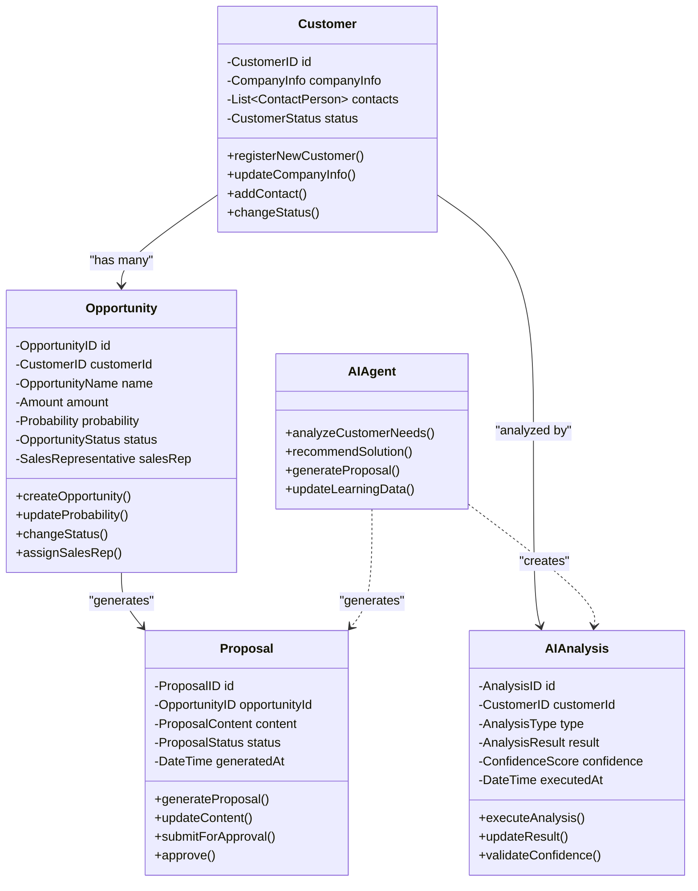

# DDDワークショップ & 既存システム整理 ～Azure移行を見据えて～

## Part 3: ドメインモデリング体験

**🎯 このフェーズの目的**
- 営業支援AIエージェントアプリの核となるビジネス概念を構造化する
- 技術者とビジネス担当者が共通言語でコミュニケーションできる基盤を作る
- Part 2で整理した現状システムの課題を解決するドメインモデルを設計する
- Part 4でのAzure移行アーキテクチャ検討の土台を準備する

**📊 想定成果物**
1. **ユビキタス言語辞書**: 営業支援AIドメインの標準用語集（50-80語）
2. **ドメインモデル図**: 主要アグリゲート・エンティティ・関係性の可視化
3. **ビジネスルール一覧**: ドメイン固有の制約・判定条件（20-30項目）
4. **アグリゲート責任範囲定義**: 各アグリゲートの境界・責任の明確化
5. **ドメインサービス仕様**: 複数アグリゲートにまたがる処理の定義

**🔄 Part 2からの引き継ぎ事項**
- **ユースケース分析結果**: アクター・機能要件の構造化済みデータ
- **業務課題構造**: 解決すべきビジネスルール・制約の明確化
- **システム境界認識**: ドメイン境界・アグリゲート設計の参考材料
- **ユビキタス言語候補**: ユースケース・課題分析から抽出した業務用語

**➡️ Part 4への受け渡し事項**
- 理想ドメインモデルの設計
- 現状システムとのギャップ明確化
- Azure移行時の技術要件

---

## 📋 目次

1. [ドメインモデリング体験](#1-ドメインモデリング体験-30分)
2. [ユビキタス言語の構築](#2-ユビキタス言語の構築)
3. [簡易ドメインモデルの作成](#3-簡易ドメインモデルの作成)
4. [成果物テンプレート](#成果物テンプレート)

---

## 1. ドメインモデリング体験 (30分)

### 1.1 営業支援AIエージェントアプリのドメイン分析 (15分)

#### 🎯 ドメイン分析の目的
1. **ビジネスイベントの体系化**: 営業プロセス全体で発生する重要な出来事を時系列で整理
2. **コマンド・アクターの特定**: 各イベントの引き金となる行動と実行者を明確化
3. **アグリゲート境界の発見**: 関連するデータと処理をまとめる単位を特定
4. **ドメインサービスの抽出**: 単一アグリゲートでは表現できない複雑な処理を識別

#### 📊 期待成果
- **ドメインイベント一覧**: 営業プロセス全体で発生する25-30個のイベント
- **イベント-コマンド-アクター対応表**: 各イベントの実行責任の明確化
- **アグリゲート候補リスト**: 4-6個のアグリゲート候補とその責任範囲
- **ドメインサービス候補**: 3-5個の複雑な処理の抽出

#### 🧠 イベントストーミング風ワーク (10分)

**Part 2からの変換ルール適用**

Part 2で特定したユースケースを元に、ドメインイベントを体系的に抽出します：

| Part 2 ユースケース | Part 3 ドメインイベント | 変換ルール |
|-------------------|---------------------|-----------|
| UC01: 見込み客登録 | `見込み客が登録された` | 動詞を過去形に変換 |
| UC05: 商談作成 | `商談が作成された` | 結果・状態変化を表現 |
| UC09: 顧客ニーズ分析 | `AIが顧客ニーズを分析した` | アクター+動作を明示 |
| UC13: 提案書自動生成 | `提案資料が自動生成された` | システム処理結果を表現 |

**Step 1: ドメインイベントの洗い出し**

営業支援AIエージェントアプリで発生する主要なビジネスイベントを付箋に書き出します：

**顧客獲得フェーズ**
- `見込み客が登録された`
- `初回面談が予約された`
- `ヒアリングシートが提出された`

**AI分析フェーズ**
- `AIが顧客ニーズを分析した`
- `最適なソリューションが提案された`
- `AIが競合比較を実行した`

**提案フェーズ**
- `提案資料が自動生成された`
- `見積もりが作成された`
- `商談がスケジュールされた`

**商談フェーズ**
- `商談が実施された`
- `商談結果が記録された`
- `フォローアップが必要と判定された`

**受注・契約フェーズ**
- `受注が確定した`
- `契約書が作成された`
- `プロジェクトが開始された`

**Step 2: イベント間の関係性整理 (5分)**

イベント間の因果関係や時系列順序を整理：

```
見込み客が登録された
    ↓
初回面談が予約された
    ↓
ヒアリングシートが提出された
    ↓
AIが顧客ニーズを分析した
    ↓
最適なソリューションが提案された
    ↓
提案資料が自動生成された
    ↓
商談がスケジュールされた
    ↓
商談が実施された
    ↓
受注が確定した / 失注が記録された
```

### 1.2 コマンド・アクター・アグリゲートの特定 (15分)

#### 📝 コマンド（Command）の特定

**Part 2アクター分析の活用**

Part 2で特定したアクターと責任範囲を基に、各ドメインイベントを引き金となるコマンドを特定：

| ドメインイベント | コマンド | アクター（実行者） | Part 2での特定根拠 |
|-----------------|----------|-------------------|------------------|
| 見込み客が登録された | 見込み客を登録する | マーケティング担当者 | UC01での責任者特定 |
| AIが顧客ニーズを分析した | AIニーズ分析を実行する | AIエージェント | UC09での処理主体特定 |
| 提案資料が自動生成された | 提案資料を生成する | 提案書生成システム | UC13での自動化範囲特定 |
| 商談が実施された | 商談を実施する | 営業担当者 | UC05-07での営業プロセス分析 |
| 受注が確定した | 受注を確定する | 営業マネージャー | 承認フロー・権限分析結果 |

#### 🏗️ アグリゲート（Aggregate）の特定

関連するエンティティと値オブジェクトをまとめたアグリゲートを特定：

**1. 顧客アグリゲート（Customer Aggregate）**
```
顧客（Customer）[アグリゲートルート]
├─ 顧客ID（CustomerID）
├─ 会社情報（CompanyInfo）
│  ├─ 会社名（CompanyName）
│  ├─ 業界（Industry）
│  └─ 企業規模（CompanySize）
├─ 担当者リスト（List<ContactPerson>）
└─ 顧客ステータス（CustomerStatus）
```

**2. 商談アグリゲート（Opportunity Aggregate）**
```
商談（Opportunity）[アグリゲートルート]
├─ 商談ID（OpportunityID）
├─ 商談名（OpportunityName）
├─ 商談金額（Amount）
├─ 受注確度（Probability）
├─ 商談ステータス（OpportunityStatus）
├─ 営業担当者（SalesRep）
└─ 活動履歴（List<Activity>）
```

**3. AI分析アグリゲート（AIAnalysis Aggregate）**
```
AI分析（AIAnalysis）[アグリゲートルート]
├─ 分析ID（AnalysisID）
├─ 対象顧客ID（CustomerID）
├─ 分析タイプ（AnalysisType）
├─ 分析結果（AnalysisResult）
│  ├─ ニーズ分析（NeedsAnalysis）
│  ├─ ソリューション推奨（RecommendedSolution）
│  └─ 競合比較（CompetitorComparison）
├─ 信頼度スコア（ConfidenceScore）
└─ 実行日時（ExecutedAt）
```

**4. 提案書アグリゲート（Proposal Aggregate）**
```
提案書（Proposal）[アグリゲートルート]
├─ 提案書ID（ProposalID）
├─ 商談ID（OpportunityID）
├─ 提案内容（ProposalContent）
│  ├─ ソリューション概要（SolutionOverview）
│  ├─ 価格（Pricing）
│  └─ 導入スケジュール（ImplementationSchedule）
├─ 提案書ステータス（ProposalStatus）
└─ 生成日時（GeneratedAt）
```

---

## 2. ユビキタス言語の構築

### 2.1 営業支援AIエージェントアプリのユビキタス言語リスト

#### 👥 人・組織に関する用語

| 用語 | 英語 | 定義 | 使用例 |
|------|------|------|--------|
| 見込み客 | Lead | まだ具体的な商談に至っていない潜在的な顧客 | 「Webサイトから問い合わせのあった見込み客」 |
| 商談相手 | Prospect | 具体的な商談を進めている相手 | 「来週プレゼンを予定している商談相手」 |
| 顧客 | Customer | 既に契約を締結している取引先 | 「継続契約を更新した顧客」 |
| 営業担当者 | Sales Representative | 商談を担当する営業職の社員 | 「この案件の営業担当者は田中さんです」 |
| ドメインエキスパート | Domain Expert | AIが分析対象とする業界・分野の専門家 | 「製造業のドメインエキスパートとして山田さんに相談」 |

#### 🤖 AI・分析に関する用語

| 用語 | 英語 | 定義 | 使用例 |
|------|------|------|--------|
| AIエージェント | AI Agent | 自律的に顧客分析や提案を行うAIシステム | 「AIエージェントが最適なソリューションを提案」 |
| ニーズ分析 | Needs Analysis | 顧客の課題や要求を体系的に分析すること | 「ヒアリング結果を基にニーズ分析を実行」 |
| ソリューション推奨 | Solution Recommendation | AIが分析結果に基づいて最適解を提案すること | 「3つのソリューション推奨が提示された」 |
| 信頼度スコア | Confidence Score | AI分析結果の確からしさを数値化したもの | 「信頼度スコア85%の高精度な分析結果」 |
| 学習データ | Training Data | AIモデルの訓練に使用される過去の実績データ | 「過去5年分の受注データを学習データとして活用」 |

#### 💼 商談・営業活動に関する用語

| 用語 | 英語 | 定義 | 使用例 |
|------|------|------|--------|
| 商談 | Opportunity | 具体的な受注を目指して進行中の営業案件 | 「今月は10件の商談が進行中」 |
| 受注確度 | Probability | 商談が成約に至る可能性を%で表現したもの | 「受注確度80%の有望案件」 |
| パイプライン | Sales Pipeline | 段階別に整理された商談の進捗状況 | 「パイプライン全体で3億円の商談が進行」 |
| 失注 | Lost Opportunity | 商談が不成立に終わった状態 | 「価格面で失注となった案件」 |
| 受注 | Won Deal | 商談が成立し契約に至った状態 | 「先月は5件の受注を獲得」 |

#### 📋 提案・資料に関する用語

| 用語 | 英語 | 定義 | 使用例 |
|------|------|------|--------|
| 提案書 | Proposal | 顧客に提示するソリューションや価格をまとめた文書 | 「AIが自動生成した提案書を確認」 |
| 見積書 | Quotation | 商品・サービスの価格を明示した文書 | 「正式な見積書を顧客に送付」 |
| RFP | Request for Proposal | 顧客からの提案依頼書 | 「RFPの要件を満たす提案を作成」 |
| デモンストレーション | Demonstration | 実際にシステムを動かして機能を紹介すること | 「来週デモンストレーションを実施予定」 |

### 2.2 ドメイン固有のビジネスルール

#### 🔍 営業支援AIエージェントアプリの重要なビジネスルール

**顧客管理ルール**
- 見込み客は初回接触から30日以内に商談化またはナーチャリングに移行する
- 同一企業からの複数部署の案件は顧客アグリゲート内で統合管理する
- 顧客情報の更新は必ず履歴として記録する

**AI分析ルール**
- AIニーズ分析は最低3つの分析軸（課題・予算・時期）で実行する
- 信頼度スコアが70%未満の分析結果は人間の確認が必須
- AI学習データは最新2年分の受注・失注データを使用する

**商談管理ルール**
- 受注確度は10%刻みで管理し、80%以上は月次予測に含める
- 商談ステータスの変更は営業担当者またはマネージャーのみ可能
- 失注時は必ず失注理由をカテゴリ分類して記録する

**提案書生成ルール**
- 提案書は顧客の業界テンプレートを基に自動生成する
- 生成された提案書は営業担当者の承認後に顧客送付可能となる
- 提案書のバージョン管理は自動で行い、変更履歴を保持する

---

## 3. 簡易ドメインモデルの作成

### 3.1 ドメインモデル図



#### 📊 ドメインモデル関係性の説明

**アグリゲート間の関係**:
- `Customer --> Opportunity`: 一つの顧客が複数の商談を持つ（1対多）
- `Customer --> AIAnalysis`: 顧客毎にAI分析が実行される（1対1）
- `Opportunity --> Proposal`: 各商談に対して提案書が作成される（1対1）

**ドメインサービスとの関係**:
- `AIAgent ..> AIAnalysis`: AIエージェントがAI分析を生成・実行（依存関係）
- `AIAgent ..> Proposal`: AIエージェントが提案書を自動生成（依存関係）

**設計原則**:
- アグリゲート間は参照IDで結合（直接オブジェクト参照ではない）
- 境界づけられたコンテキスト内での整合性保証
- ドメインサービスによる複雑なビジネスロジックの実装

### 3.2 ドメインサービスの特定

#### 🔧 営業支援AIエージェントアプリのドメインサービス

**1. 顧客マッチングサービス（CustomerMatchingService）**
```csharp
public class CustomerMatchingService
{
    // 類似する既存顧客を特定し、営業戦略の参考とする
    public List<Customer> FindSimilarCustomers(Customer newCustomer)
    
    // 重複する可能性のある顧客エントリを検出
    public List<DuplicationCandidate> DetectDuplicateCustomers(Customer customer)
}
```

**2. AI分析結果検証サービス（AnalysisValidationService）**
```csharp
public class AnalysisValidationService
{
    // AI分析結果の妥当性を検証
    public ValidationResult ValidateAnalysisResult(AIAnalysis analysis)
    
    // 人間の専門家による分析結果の確認が必要かを判定
    public bool RequiresHumanValidation(AIAnalysis analysis)
}
```

**3. 提案書最適化サービス（ProposalOptimizationService）**
```csharp
public class ProposalOptimizationService
{
    // 顧客特性に基づいて提案書の内容を最適化
    public Proposal OptimizeProposal(Proposal proposal, Customer customer)
    
    // 競合他社との差別化ポイントを提案書に反映
    public Proposal AddDifferentiation(Proposal proposal, CompetitorAnalysis analysis)
}
```

**4. 売上予測サービス（SalesForecastService）**
```csharp
public class SalesForecastService
{
    // パイプライン内の商談から月次売上予測を算出
    public SalesForecast CalculateMonthlyForecast(List<Opportunity> opportunities)
    
    // 過去実績とAI分析を組み合わせて精度の高い予測を生成
    public SalesForecast GenerateAIEnhancedForecast(List<Opportunity> opportunities)
}
```

---

## 成果物テンプレート

## 成果物テンプレート・品質基準

### 📝 ユビキタス言語辞書テンプレート（目標50-80語）

| No | カテゴリ | 日本語用語 | 英語用語 | 定義 | 使用例・制約条件 | 関連語 | 備考 |
|----|---------|-----------|---------|------|----------------|--------|------|
| 1 | 顧客関連 | 見込み客 | Lead | まだ商談に至っていない潜在顧客 | Web問い合わせ、展示会名刺交換等<br/>有効期限: 初回接触から30日 | 商談相手、顧客 | マーケティング部門管理 |
| 2 | AI関連 | ニーズ分析 | Needs Analysis | 顧客課題の体系的分析 | 必須・希望・潜在ニーズに3分類<br/>信頼度スコア70%以上で承認 | ソリューション推奨 | AIエージェント実行 |
| 3 | 商談関連 | 受注確度 | Probability | 成約可能性の%表現 | 10%刻みで管理<br/>80%以上は月次予測対象 | パイプライン、商談 | 営業担当者判定 |
| 4 | 提案関連 | 提案書 | Proposal | 顧客向けソリューション提案文書 | 業界テンプレート基盤<br/>営業担当者承認必須 | 見積書、契約書 | AI自動生成+人間確認 |

**✅ 品質基準**
- [ ] 50語以上の用語定義完了
- [ ] 全用語に英語対訳・使用例記載
- [ ] カテゴリ別分類（顧客・AI・商談・提案・その他）
- [ ] 関連語・制約条件の明記
- [ ] 全参加者での用語統一確認

### 🏗️ ドメインモデル成果物テンプレート

#### アグリゲート設計書（4-6個想定）

**アグリゲート名**: 顧客アグリゲート（Customer Aggregate）

**責任範囲**: 顧客の基本情報管理と商談ライフサイクルの整合性保証

**アグリゲートルート**: Customer エンティティ

**内包エンティティ・値オブジェクト**:
- **Customer** [エンティティ]: 顧客の一意性と状態管理
- **CompanyInfo** [値オブジェクト]: 会社名・業界・規模等の基本情報
- **ContactPerson** [エンティティ]: 顧客企業内の担当者情報
- **CustomerStatus** [値オブジェクト]: Lead → Prospect → Customer の状態管理

**重要なビジネスルール**:
1. 見込み客は初回接触から30日以内に商談化またはナーチャリングに移行
2. 同一企業の複数部署案件は統合管理（重複排除）
3. 顧客情報更新は必ず履歴として記録（監査要件）
4. 顧客ステータス変更は営業担当者またはマネージャーのみ実行可能

**他アグリゲートとの関係**:
- 商談アグリゲート: 1:N の関係（一つの顧客が複数商談を持つ）
- AI分析アグリゲート: 1:N の関係（顧客毎に複数分析実行）

**技術制約・非機能要件**:
- 同時更新: 楽観的ロック（バージョン管理）
- 性能要件: 顧客検索レスポンス 500ms以内
- データ保持: 個人情報は契約終了後3年で削除

### 🔧 ドメインサービス仕様テンプレート

**サービス名**: 顧客マッチングサービス（CustomerMatchingService）

**目的**: 類似顧客の特定と重複排除による営業戦略支援

**所属するバウンデッドコンテキスト**: 営業管理コンテキスト

**主要メソッド・責任**:
```csharp
public class CustomerMatchingService
{
    // 新規見込み客に類似する既存顧客を特定（営業戦略参考用）
    public List<SimilarCustomer> FindSimilarCustomers(
        Customer newCustomer, 
        SimilarityThreshold threshold = 0.8)
    
    // 重複の可能性がある顧客エントリを検出（データ品質保証用）
    public List<DuplicationCandidate> DetectDuplicateCustomers(
        Customer customer,
        DuplicateDetectionRules rules)
    
    // 顧客の営業戦略パターンを推奨（過去実績ベース）
    public SalesStrategyRecommendation RecommendSalesStrategy(
        Customer customer, 
        List<Customer> similarCustomers)
}
```

**依存関係**:
- CustomerRepository: 顧客データアクセス
- SalesHistoryRepository: 過去営業実績データアクセス
- AIAnalysisService: 機械学習ベース類似度算出

**非機能要件**:
- パフォーマンス: 類似顧客検索 3秒以内
- 精度: 類似度判定精度 85%以上
- 可用性: 99.9%稼働率（営業業務クリティカル）

### 🎯 ドメインモデリング完了基準

**📊 成果物完成度目標**
- ユビキタス言語辞書: 50語以上定義（目標80語）
- アグリゲート設計: 4-6個完成（責任範囲明確化）
- ビジネスルール: 20-30項目整理（制約・判定条件）
- ドメインサービス: 3-5個定義（複雑処理の抽出）

**🤝 参加者理解度目標**
- DDDの基本概念理解: 全員90%以上
- ユビキタス言語の活用: 全員85%以上
- アグリゲート設計思想: 技術者90%以上
- ビジネスルール整理: 業務担当者95%以上

**➡️ Part 4への引き継ぎ品質基準**
- [ ] 理想ドメインモデルの合意形成完了
- [ ] 現状システムとのギャップ特定準備完了
- [ ] Azure移行時の技術要件明確化
- [ ] 実装・運用フェーズへの移行準備完了

---

**Previous:** [Part 2: 既存業務・システム整理 & 現状課題の棚卸し](workshop-part2-current-system-analysis.md)  
**Next:** [Part 4: システム構成とドメインのマッピング & Azure移行メリット](workshop-part4-azure-mapping.md)
