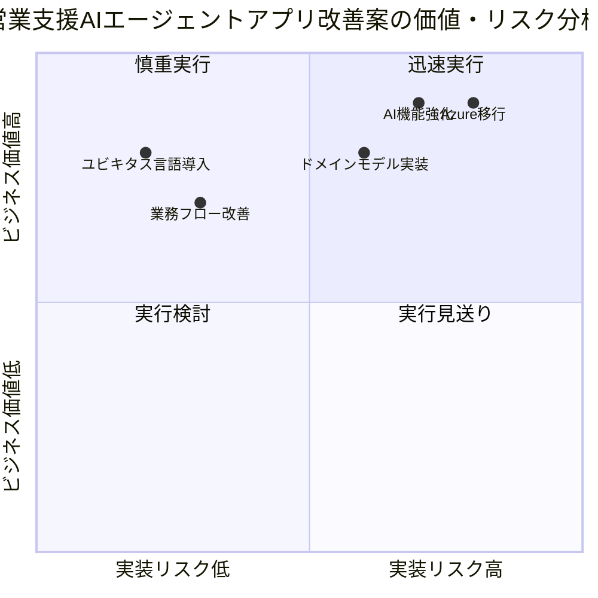
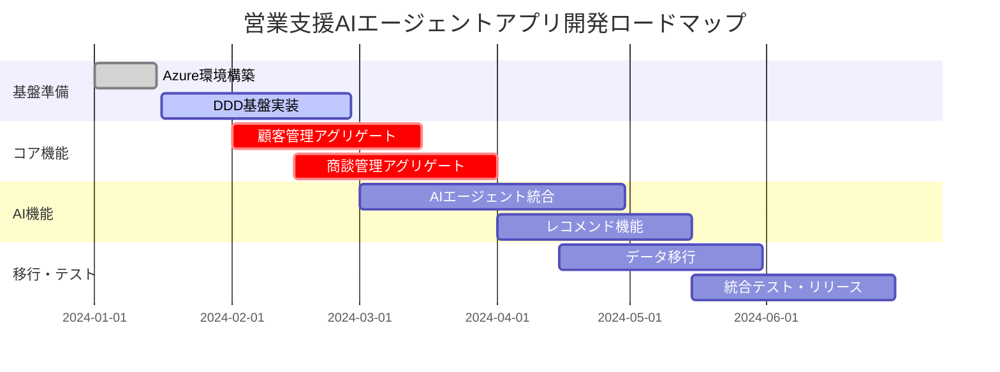
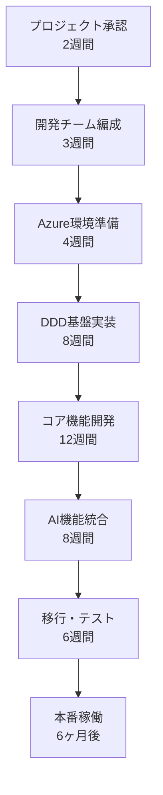

# DDDワークショップ & 既存システム整理 ～Azure移行を見据えて～

## Part 5: クロージング・成果統合・今後のアクション (30分)

**🎯 このフェーズの目的**
- 4つのPartで得られた成果物を統合し、プロジェクトとして活用可能な形にまとめる
- ワークショップで明確になった次のアクションステップを具体化する
- 継続的なDDD実践・Azure移行推進のための体制を構築する
- 参加者の学習成果を確認し、今後のスキル開発指針を設定する

**📊 想定成果物**
1. **統合成果レポート**: 4つのPartの結果を一元化した総合報告書
2. **アクションプラン**: 3-6ヶ月の具体的な実行計画（担当者・期限付き）
3. **継続学習ロードマップ**: DDD・Azure関連の個人・チーム学習計画
4. **プロジェクト体制案**: 実装フェーズでの役割分担・責任範囲
5. **定期レビュー計画**: 進捗確認・方向性修正のための仕組み

**🔄 Part 1-4からの引き継ぎ事項**
- DDDの基本概念理解とワークショップ運営の振り返り
- 現状業務・システム分析と課題の構造化
- ドメインモデル・ユビキタス言語・ビジネスルール
- Azure移行アーキテクチャ・効果試算・リスク対策

**➡️ プロジェクト実行フェーズへの受け渡し事項**
- 承認・意思決定のための資料一式
- 実装チーム向けの技術仕様・制約事項
- ステークホルダー・経営層への報告資料

---

## 📋 目次

1. [成果物統合・プロジェクト総括](#1-成果物統合プロジェクト総括-15分)
2. [今後のアクションプランニング](#2-今後のアクションプランニング-10分)
3. [学習・振り返り](#3-学習振り返り-5分)
4. [統合成果物テンプレート](#統合成果物テンプレート)

---

## 1. 成果物統合・プロジェクト総括 (15分)

### 1.1 4つのPartの成果統合 (10分)

#### 🎯 統合の目的
1. **一貫性の確認**: 各Partの成果物が矛盾なく整合しているかをチェック
2. **価値の明確化**: ワークショップ全体で得られたビジネス価値を定量化
3. **実行可能性の検証**: 提案内容が現実的で実行可能かを最終確認
4. **承認資料の準備**: 経営層・意思決定者への提案に必要な要素を整理

#### 📊 統合ワーク手順

**Step 1: 成果物マトリックスの作成 (5分)**

| Part | 主要成果物 | ビジネス価値 | 技術的品質 | 実行リスク |
|------|------------|-------------|------------|------------|
| **Part 1** | DDD基本理解・チーム体制 | コミュニケーション効率化 | ⭐⭐⭐⭐⭐ | 低 |
| **Part 2** | 業務フロー・課題分析 | 業務プロセス改善 | ⭐⭐⭐⭐ | 中 |
| **Part 3** | ドメインモデル・ユビキタス言語 | 開発効率・品質向上 | ⭐⭐⭐⭐ | 中 |
| **Part 4** | Azure移行計画・ROI試算 | コスト削減・性能向上 | ⭐⭐⭐ | 高 |

**Step 2: 全体一貫性チェック (3分)**

チェック項目:
- [ ] Part 2の課題がPart 3のドメインモデルで解決されているか
- [ ] Part 3のアグリゲートがPart 4のAzureサービス選定に反映されているか
- [ ] ユビキタス言語がPart 2-4で一貫して使用されているか
- [ ] Azure移行効果がPart 2の課題に対する具体的解決策になっているか

**Step 3: 価値・リスクバランスの評価 (2分)**

### 1.2 ROI・効果の最終確認 (5分)

#### 💰 定量効果の整理

| 効果カテゴリ | 年間効果額 | 根拠・計算式 | 実現時期 |
|-------------|------------|-------------|----------|
| **営業効率向上** | ¥12,000,000 | 商談準備時間50%削減×営業5名×年間240営業日×時給¥5,000 | 6ヶ月後 |
| **システム運用コスト削減** | ¥3,600,000 | オンプレミス保守費¥300万+電力・設備費¥60万 | 3ヶ月後 |
| **開発効率向上** | ¥8,400,000 | 機能追加・修正時間30%削減×開発3名×年間200稼働日×時給¥7,000 | 12ヶ月後 |
| **データ品質向上** | ¥6,000,000 | 顧客情報精度向上による成約率5%向上×年間受注¥120M×利益率10% | 9ヶ月後 |
| **合計** | **¥30,000,000** | | |

#### 💸 投資・コストの整理

| 投資カテゴリ | 金額 | 期間 | 備考 |
|-------------|------|------|------|
| **Azure移行コスト** | ¥8,000,000 | 6ヶ月 | 開発・移行・テスト |
| **人材教育・研修** | ¥2,000,000 | 12ヶ月 | DDD・Azure・AI技術 |
| **Azure運用コスト** | ¥2,400,000/年 | 継続 | 月額¥200,000想定 |
| **外部支援コスト** | ¥3,000,000 | 6ヶ月 | アーキテクト・コンサル |
| **初年度総投資** | **¥15,400,000** | | |

**ROI計算**: (¥30,000,000 - ¥15,400,000) ÷ ¥15,400,000 = **94.8%**

---

## 2. 今後のアクションプランニング (10分)

### 2.1 短期アクション（1-3ヶ月） (4分)

#### 🚀 即座実行項目

| アクション | 担当者 | 期限 | 成果指標 |
|------------|--------|------|----------|
| **経営層承認取得** | PM・部長 | 2週間後 | 予算・体制承認 |
| **開発チーム編成** | PM | 3週間後 | 5名体制確立 |
| **Azure環境準備** | インフラ担当 | 4週間後 | 開発環境構築完了 |
| **外部支援先選定** | PM・調達 | 4週間後 | 契約締結完了 |
| **詳細要件定義開始** | 業務担当・SE | 5週間後 | 要件定義書初版 |

#### 📚 並行学習項目

| 学習項目 | 対象者 | 期限 | 成果指標 |
|----------|--------|------|----------|
| **DDDパターン学習** | 開発チーム全員 | 6週間後 | 実装パターン理解 |
| **Azure AI Services習得** | AI機能担当 | 8週間後 | プロトタイプ作成可能 |
| **Azure DevOps習得** | 全開発メンバー | 4週間後 | CI/CD環境構築 |

### 2.2 中期アクション（3-6ヶ月） (3分)

#### 🔧 開発・実装フェーズ

### 2.3 長期アクション（6ヶ月以降） (3分)

#### 📈 継続改善・展開フェーズ

| フェーズ | 期間 | 主要アクション | 期待成果 |
|----------|------|----------------|----------|
| **安定運用** | 6-9ヶ月 | パフォーマンス最適化・ユーザー研修 | 利用率80%以上 |
| **機能拡張** | 9-12ヶ月 | マーケティング連携・予測分析機能 | 売上15%向上 |
| **他部門展開** | 12-18ヶ月 | カスタマーサポート・人事への横展開 | 全社DX推進 |

---

## 3. 学習・振り返り (5分)

### 3.1 ワークショップ振り返り (3分)

#### 🎓 学習成果確認

**個人学習チェックリスト**
- [ ] DDDの3つの主要概念（ユビキタス言語・境界づけられたコンテキスト・アグリゲート）を説明できる
- [ ] 営業支援AIアプリのドメインモデルを理解し、他者に説明できる
- [ ] 現状システムの課題とAzure移行による解決策を整理できている
- [ ] 次のアクションで自分が担当すべき項目を明確化できている

**チーム成果確認**
- [ ] ユビキタス言語辞書が業務・技術双方の担当者で共有されている
- [ ] 作成したドメインモデルがビジネス要件を適切に表現している
- [ ] Azure移行計画が具体的で実行可能な内容になっている
- [ ] ROI・リスク評価が意思決定に十分な精度で算出されている

### 3.2 継続学習プラン (2分)

#### 📚 推奨学習リソース

**DDD深化**
- 「実践ドメイン駆動設計」（書籍）
- DDD Community Japan（勉強会）
- GitHub実装サンプル研究

**Azure技術**
- Microsoft Learn（AI Services・Container Apps）
- Azure Well-Architected Framework
- Azure DevOps実践

**営業支援AI**
- Copilot Studio活用
- Power Platform連携
- BI・データ分析基盤

---

## 統合成果物テンプレート

### 📋 統合成果レポート（経営層向け）

#### エグゼクティブサマリー
**プロジェクト名**: 営業支援AIエージェントアプリ のDDD・Azure移行プロジェクト

**投資対効果**:
- 初年度ROI: 94.8%
- 投資回収期間: 7.4ヶ月
- 年間期待効果: ¥30,000,000

**実行リスク**: 中程度（開発技術・移行技術の習得）
**推奨判定**: ✅ 承認推奨

#### 詳細効果・根拠

| 効果カテゴリ | 現状の課題 | 改善後の状態 | 定量効果 |
|-------------|-----------|-------------|----------|
| **営業効率** | 商談準備に4時間/件 | AI支援で2時間/件 | ¥12M/年 |
| **システム保守** | オンプレ保守費¥360万/年 | Azure運用¥240万/年 | ¥3.6M/年 |
| **開発生産性** | 機能追加に2週間/件 | DDDで1週間/件 | ¥8.4M/年 |
| **データ品質** | 顧客情報重複・不整合20% | データ統合で5%以下 | ¥6M/年 |

#### 実行計画・体制

**プロジェクト体制**:
- **PM**: [担当者名]（全体統括・進捗管理）
- **アーキテクト**: [担当者名]（技術方針・レビュー）
- **業務代表**: [担当者名]（要件定義・受入テスト）
- **開発チーム**: [担当者名×3名]（実装・テスト）
- **インフラ**: [担当者名]（Azure環境・運用）

#### リスク・対策

| リスク | 発生確率 | 影響度 | 対策 |
|--------|----------|--------|------|
| **技術習得遅延** | 40% | 中 | 外部エキスパート活用・段階的習得 |
| **要件変更** | 30% | 中 | 反復開発・短期リリース |
| **Azure移行障害** | 20% | 高 | 段階移行・ロールバック計画 |
| **ユーザー受入遅延** | 25% | 中 | 早期プロトタイプ・継続研修 |

### 📊 継続レビュー計画

#### 定期レビュー体制

| レビュー種別 | 頻度 | 参加者 | 主要議題 |
|-------------|------|--------|----------|
| **週次進捗会議** | 毎週金曜 | PM・開発チーム | 進捗・課題・来週計画 |
| **月次ステアリング** | 月末 | PM・部長・業務代表 | 全体進捗・リスク・意思決定 |
| **四半期レビュー** | 3ヶ月毎 | 経営層・全関係者 | 成果・ROI実績・方針見直し |

#### 成功指標・KPI

| 指標カテゴリ | KPI | 目標値 | 測定方法 |
|-------------|-----|--------|----------|
| **開発進捗** | 計画どおり進捗率 | 90%以上 | ガントチャート |
| **品質** | バグ密度 | 5件/KLOC以下 | テスト管理ツール |
| **利用率** | 営業メンバー利用率 | 80%以上 | システムログ |
| **効果** | 商談準備時間削減率 | 50%以上 | 業務時間測定 |

---

## ✅ クロージング完了チェックリスト

### 成果物品質確認
- [ ] **統合レポート**: 4つのPartの成果が矛盾なく統合されている
- [ ] **ROI計算**: 前提条件・計算式が明確で検証可能
- [ ] **アクションプラン**: 担当者・期限・成果指標が全項目で明記されている
- [ ] **リスク対策**: 主要リスクに対する具体的対策が用意されている

### 実行準備確認
- [ ] **承認資料**: 経営層説明に必要な資料が準備されている
- [ ] **チーム体制**: 役割分担・責任範囲が明確化されている
- [ ] **学習計画**: 必要スキルの習得計画が策定されている
- [ ] **レビュー体制**: 継続的な進捗管理の仕組みが設計されている

### 参加者合意確認
- [ ] **今後のアクション**: 全参加者が自分の担当項目を理解している
- [ ] **期待成果**: 成功の定義・判定基準について合意されている
- [ ] **リスク認識**: 想定されるリスクと対策について共有されている
- [ ] **コミュニケーション**: 今後の連絡・報告ルールが確立されている

---

## 🎉 ワークショップ修了

### お疲れさまでした！

本日のDDDワークショップ & Azure移行検討セッションにご参加いただき、ありがとうございました。

**皆様の成果**:
- ✅ DDDの基本概念を実践的に習得
- ✅ 営業支援AIアプリの現状課題を構造化
- ✅ 理想的なドメインモデルを設計
- ✅ Azure移行による具体的な効果を算出
- ✅ 実行可能なアクションプランを策定

**次のステップ**:
1. **2週間以内**: 経営層への提案・承認取得
2. **1ヶ月以内**: プロジェクト体制の立ち上げ
3. **3ヶ月以内**: 開発開始・初期成果の創出

皆様の営業支援AIエージェントアプリが、DDDとAzureの力でより価値の高いシステムになることを確信しています。

### 📞 今後のサポート

- **技術相談**: DDD実装・Azure移行の技術的質問
- **レビュー支援**: 設計・実装レビューのファシリテーション
- **研修・勉強会**: チームスキル向上のための継続支援

**引き続き、どうぞよろしくお願いいたします！** 🙇‍♂️
